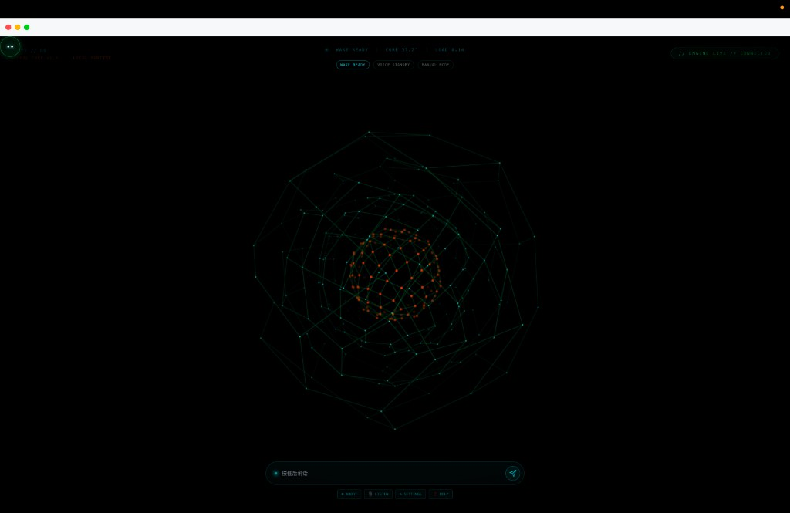

# Zesty OS 2.0

**Creator:** [Sanjay Darnal](https://github.com/ccbarconsultancy-collab)

<p align="center">
  <a href="https://github.com/ccbarconsultancy-collab/Zesty-OS-2.0/releases/latest">
    
  </a>
  <a href="https://opensource.org/licenses/MIT">
    
  </a>
  <a href="https://github.com/ccbarconsultancy-collab/Zesty-OS-2.0/stargazers">
    
  </a>
</p>

English | [简体中文](README.zh.md)

## About Zesty OS 2.0

**Zesty OS 2.0** is a cross-platform AI voice assistant built by **Sanjay Darnal**, combining a custom HTML neural-core front-end with the proven [py-xiaozhi](https://github.com/huangjunsen0406/py-xiaozhi) async backend engine. It delivers real-time voice streaming, wake-word detection, MCP tool integration, and low-latency human–AI interaction on Windows, macOS, and Linux.

> Built on the [py-xiaozhi](https://github.com/huangjunsen0406/py-xiaozhi) core engine by Saoji (Junsen Huang). Evolved from the [xiaozhi-esp32](https://github.com/78/xiaozhi-esp32) firmware project.

## Demo



## Zesty OS 2.0 Key Features

- **Custom HTML/JS Responsive UI** — Modern neural-core wrapper (`assets/index.html`) embedded via PySide6 WebEngine + QWebChannel bridge
- **High-Performance UI-to-Backend Bridge** — Real-time voice streaming, session control, and state sync between the HTML front-end and Python core
- **Real-Time Audio Intelligence** — On-device wake-word detection (Sherpa-ONNX), Opus encoding, STT/TTS pipeline, and low-latency interaction
- **Seamless py-xiaozhi Integration** — Full access to WebSocket/MQTT protocols, MCP tools, activation, settings, and plugin architecture without replacing the core engine

### Core Engine Capabilities (py-xiaozhi)

- **Real-time Voice AI** — Opus codec with async streaming, sub-20ms latency
- **Multi-modal Vision** — Camera capture + vision-language model integration
- **MCP Tool Ecosystem** — Music, camera, screenshot, app management, weather, volume control
- **Cross-platform Deployment** — Windows 10+ / macOS 10.15+ / Linux (x86_64 & ARM)
- **Offline Wake Word** — Sherpa-ONNX on-device keyword spotting with custom wake words
- **WebSocket / MQTT** — Dual protocol communication with WSS/TLS and auto-reconnection
- **Plugin Architecture** — Event-driven async design with dependency injection

## Quick Start (Installation)

```bash
# Clone repository
git clone https://github.com/ccbarconsultancy-collab/Zesty-OS-2.0.git
cd Zesty-OS-2.0

# Create and activate virtual environment
python3 -m venv .venv
source .venv/bin/activate          # Windows: .venv\Scripts\activate

# Install with GUI dependencies (PySide6 + qasync)
pip install -e ".[gui]"

# Launch Zesty OS 2.0 with custom HTML UI
python main.py --mode gui
# or
zesty --mode gui
```

Optional flags:

```bash
python main.py --skip-activation --mode gui   # Skip device activation (local dev)
python main.py --protocol websocket           # Default protocol
python main.py --protocol mqtt                # MQTT protocol
```

## System Requirements

### Basic Requirements

- **Python Version**: 3.10 - 3.12
- **Operating System**: Windows 10+, macOS 10.15+, Linux
- **Audio Devices**: Microphone and speaker devices
- **Network Connection**: Stable internet connection (for AI services and online features)

### Recommended Configuration

- **Memory**: At least 4GB RAM (8GB+ recommended)
- **Processor**: Modern CPU with AVX instruction set support
- **Storage**: At least 2GB available disk space (for model files and cache)
- **Audio**: Audio devices supporting 16kHz sampling rate

### Optional Feature Requirements

- **Voice Wake-up**: Requires Sherpa-ONNX speech recognition models (bundled under `models/`)
- **Camera Features**: Requires camera device and OpenCV support

## Read This First

- The main branch has the latest code; reinstall pip dependencies after each update
- Upstream docs: [py-xiaozhi documentation](https://huangjunsen0406.github.io/py-xiaozhi/)

## Technical Architecture

### Core Architecture Design

- **Event-Driven Architecture**: Based on asyncio asynchronous event loop, supporting high-concurrency processing
- **Layered Design**: Clear separation of application layer, protocol layer, and UI layer
- **Dependency Injection**: Component lifecycle managed via bootstrap container
- **Plugin System**: Audio, UI, MCP tools and other components loaded via plugin system

### Key Technical Components

- **Audio Processing**: Opus codec, real-time resampling
- **Speech Recognition**: Sherpa-ONNX offline models, wake word recognition
- **Protocol Communication**: WebSocket/MQTT dual protocol support, encrypted transmission, auto-reconnection
- **Configuration System**: Hierarchical configuration, dot notation access, dynamic updates

### Performance Optimization

- **Async First**: Full system asynchronous architecture, avoiding blocking operations
- **Memory Management**: Smart caching, garbage collection
- **Audio Optimization**: 5ms low-latency processing, queue management, streaming transmission
- **Concurrency Control**: Task pool management, semaphore control, thread safety

### Security Mechanisms

- **Encrypted Communication**: WSS/TLS encryption, certificate verification
- **Device Authentication**: Dual protocol activation, device fingerprint recognition
- **Access Control**: Tool permission management, API access control
- **Error Isolation**: Exception isolation, fault recovery, graceful degradation

## Zesty OS 2.0 Development Guide

### Project Structure

```
Zesty-OS-2.0/
├── main.py                     # Application entry point
├── assets/
│   ├── index.html              # Custom HTML neural-core UI (Zesty OS 2.0)
│   └── preview.png             # UI preview screenshot
├── src/
│   ├── activation/             # Device activation
│   ├── audio_codecs/           # Audio codecs
│   ├── audio_processing/       # Wake word detection
│   ├── bootstrap/              # Application bootstrap & dependency injection
│   ├── core/                   # Event bus, state management, protocol manager
│   ├── mcp/                    # MCP tool system
│   ├── plugins/                # Audio, UI, MCP, wake word, shortcuts
│   ├── protocols/              # WebSocket / MQTT
│   └── ui/gui/                 # PySide6 + QML + HtmlUiBridge
├── models/                     # Wake word ONNX models
├── pyproject.toml              # Project configuration
└── build.json                  # Build configuration
```

### Development Environment Setup

```bash
# Clone project
git clone https://github.com/ccbarconsultancy-collab/Zesty-OS-2.0.git
cd Zesty-OS-2.0

# Base install (CLI / GPIO mode)
uv sync                                    # Recommended (uv users)
# or: pip install -e .                    # pip users

# GUI mode (extra: PySide6 + qasync)
uv sync --extra gui                        # Recommended (uv users)
# or: pip install -e '.[gui]'             # pip users

# Full development environment (GUI + test / packaging tools)
uv sync --extra gui --group dev

# Code formatting
./format_code.sh

# Run program - GUI mode (default; requires gui extra)
python main.py --mode gui
# or: zesty --mode gui

# Run program - CLI mode (base install is enough)
python main.py --mode cli

# Specify communication protocol
python main.py --protocol websocket  # WebSocket (default)
python main.py --protocol mqtt       # MQTT protocol
```

### Core Development Patterns

- **Async First**: Use `async/await` syntax, avoid blocking operations
- **Error Handling**: Complete exception handling and logging
- **Configuration Management**: Use `ConfigManager` for unified configuration access
- **Test-Driven**: Write unit tests to ensure code quality

### Extension Development

- **Add MCP Tools**: Create new tool modules in `src/mcp/tools/` directory
- **Add Protocols**: Implement `Protocol` abstract base class
- **Add Plugins**: Extend the plugin system via `src/plugins/`

### State Transition Diagram

```
                        +----------------+
                        |                |
                        v                |
+------+  Wake/Button  +------------+   |   +------------+
| IDLE | -----------> | CONNECTING | --+-> | LISTENING  |
+------+              +------------+       +------------+
   ^                                            |
   |                                            | Voice Recognition Complete
   |          +------------+                    v
   +--------- |  SPEAKING  | <-----------------+
     Playback +------------+
     Complete
```

## Contributing

- Start with [CONTRIBUTING.md](./CONTRIBUTING.md) for the repository workflow
- Chinese version: [CONTRIBUTING_ZH.md](./CONTRIBUTING_ZH.md)
- Upstream contribution guide: [py-xiaozhi contributing](https://huangjunsen0406.github.io/py-xiaozhi/en/contributing)

## Maintainer Workflow

- Triage incoming work as `bug`, `feature`, `docs`, `refactor`, or `maintenance`
- Prefer focused pull requests with clear validation steps and linked context
- Require docs updates when behavior, configuration, or public APIs change
- Merge after CI passes and review feedback is resolved
- Release through the normal release flow; merge does not imply immediate shipping

## Community and Support

### Credits

- **Zesty OS 2.0** — Sanjay Darnal (custom HTML UI, integration, branding)
- **py-xiaozhi core engine** — [Saoji / Junsen Huang](https://github.com/huangjunsen0406/py-xiaozhi)

## Project Statistics

[](https://www.star-history.com/#ccbarconsultancy-collab/Zesty-OS-2.0&Date)

## License

[MIT License](LICENSE)
